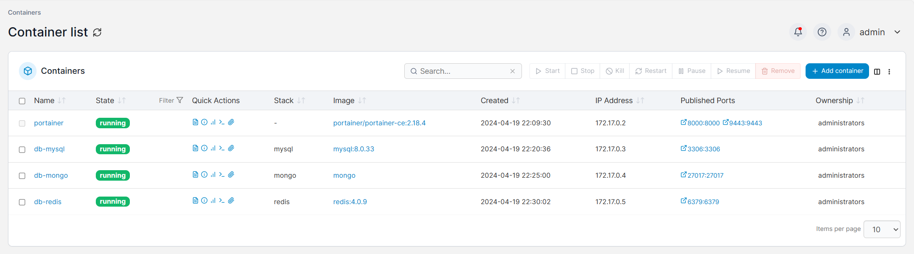

# MulberryDoc: 在线协同编辑系统

## 开发与部署

### 环境准备
- 开发工具：IDEA
- 操作系统：Ubuntu 22.04

### 安装 Docker CE
在 Ubuntu 服务器上执行以下步骤：

```bash
sudo apt update
sudo apt install -y apt-transport-https ca-certificates curl software-properties-common
curl -fsSL https://download.docker.com/linux/ubuntu/gpg | sudo apt-key add -
sudo add-apt-repository "deb [arch=amd64] https://download.docker.com/linux/ubuntu focal stable"
sudo apt update
sudo apt install -y docker-ce
sudo systemctl status docker

# 添加用户到 Docker 用户组
sudo usermod -aG docker ${USER}
su - ${USER}
```

#### 配置镜像加速器
针对 Docker 客户端版本大于 1.10.0 的用户，修改配置文件 `/etc/docker/daemon.json`，添加加速器：

```bash
sudo mkdir -p /etc/docker
sudo tee /etc/docker/daemon.json <<-'EOF'
{
  "registry-mirrors": ["https://docker.mirrors.tuna.tsinghua.edu.cn"]
}
EOF
sudo systemctl daemon-reload
sudo systemctl restart docker
```

### 安装数据库
可选：使用 docker-compose 或 Portainer 部署数据库。

#### 使用 Portainer 部署数据库
1. 部署 Portainer：

```bash
docker volume create portainer_data
docker run -d -p 8000:8000 -p 9443:9443 --name portainer --restart=always -v /var/run/docker.sock:/var/run/docker.sock -v portainer_data:/data portainer/portainer-ce:2.18.4
```

2. 登录 Portainer，创建以下 stack：

- MySQL

```yaml
version: '3'

services:
    mysql:
        image: mysql:8.0.33
        container_name: db-mysql
        command:
            --default-authentication-plugin=mysql_native_password
            --character-set-server=utf8mb4
            --collation-server=utf8mb4_general_ci
        environment:
            MYSQL_ROOT_PASSWORD: 123456 # root用户的密码
        ports:
            - "3306:3306"
        restart: always
        volumes:
            - /usr/local/mysql/data:/var/lib/mysql
            - /usr/local/mysql/conf:/etc/mysql/conf.d
            - /usr/local/mysql/logs:/logs
            - /etc/localtime:/etc/localtime:ro
            - /etc/timezone:/etc/timezone:ro
        network_mode: bridge
```

- MongoDB

```yaml
version: '3'

services:
    mysql:
        image: mongo
        container_name: db-mongo
        ports:
            - "27017:27017"
        restart: always
        volumes:
            - /usr/local/mongo/data:/data/db
            - /etc/localtime:/etc/localtime:ro
            - /etc/timezone:/etc/timezone:ro
        network_mode: bridge
```

- Redis

```yaml
version: '3'

services:
    mysql:
        image: redis:4.0.9
        container_name: db-redis
        ports:
            - "6379:6379"
        restart: always
        volumes:
            - /usr/local/redis/data:/data
            - /etc/localtime:/etc/localtime:ro
            - /etc/timezone:/etc/timezone:ro
        network_mode: bridge
```



#### 准备数据表
TODO

### 运行相关组件
TODO